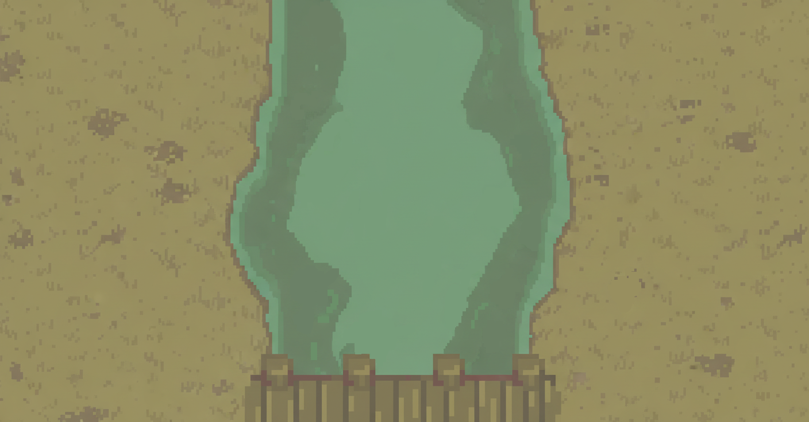

# ♻️ EcoGuardianes: Misión ODS 12

Un videojuego educativo 2D diseñado para niños y niñas de **6 a 11 años**. El proyecto se centra en enseñar los principios del **Objetivo de Desarrollo Sostenible (ODS) 12: Producción y Consumo Responsables**, utilizando como base las **7R** (Rediseñar, Reducir, Reutilizar, Reparar, Renovar, Recuperar y Reciclar.).
El objetivo es concienciar sobre la gestión de residuos y el consumo responsable de una manera divertida, interactiva y, sobre todo, adaptada a sus edades.

---

## ✨ Características Principales

* **Público Adaptativo:** El juego incluye **3 etapas de dificultad** (Principiante, Intermedio, Avanzado). Esta configuración ajusta la velocidad y complejidad de los minijuegos para adaptarse al rango de edad de 6 a 12 años.
* **Menú de Opciones:** Un menú de configuración completo que permite al jugador:
    * Ajustar el **Volumen** (Música y Efectos de Sonido).
    * Seleccionar la **Dificultad**.
    * Cambiar el **Idioma** (Inglés y Español).

---

## 🕹️ Los Niveles del Juego

El juego se compone de tres minijuegos principales, cada uno enfocado en una "R" diferente.

### Etapa 1: ¡El Río Contaminado! (Reducir / Reciclar / )

En este nivel, el jugador debe limpiar un río clasificando la basura que cae.

* **Mecánica:** Hay 3 botes de basura en la parte inferior de la pantalla. La basura cae desde un río en la parte superior.
* **Objetivo:** El jugador debe recolectar la basura que cae en el bote correcto.
* **Reglas:**
    * Cada basura errada (colocada en el bote incorrecto) resta puntos.
    * * **Desafío:** Un **"enemigo que tire objetos que quiten puntos al jugador"** aparecera el enemigo lanzando objetos al jugador para evitar que logre la meta, siento estos objetos: troncos de madera y una bomba.
    * **¡Giro clave!** Cuando un bote de basura se completa (alcanza su meta), se bloquea, deja de moverse y ya no suma más puntos. Esto incrementa el desafío al forzar al jugador a gestionar los contenedores restantes.
* **Esenario para la etapa 1:**

### Etapa 2: El Taller de Reparaciones (Reparar / Renovar / Recuperar))

Este nivel se enfoca en la importancia de reparar objetos en lugar de desecharlos.

* **Mecánica:** Aparece un objeto roto en el centro de la pantalla.
* **Objetivo:** A un lado, el jugador tiene un panel con las herramientas necesarias (martillo, destornillador, pegamento, etc.). Debe seleccionar la herramienta correcta y aplicarla en la zona dañada.
* **Desafío:** Un **"enemigo distractor"** aparecerá en pantalla para interrumpir al jugador y evitar que complete su tarea a tiempo (ej. tapando la visión(principiante y intermedio), invirtiendo los controles del juego(nivel profecional)).
* * **Esenario para la etapa 1:**

### Etapa 3: La Cinta Transformadora (Reutilizar / Rediseñar)

El nivel final enseña cómo los objetos "viejos" pueden tener una nueva vida y propósito.

* **Mecánica:** Es un nivel de ritmo (Quick Time Event - QTE). Una cinta transportadora mueve diferentes objetos (botella de plastico, periodico, lata de aluminio).
* **Objetivo:** Los objetos pasan por un lugar determinado ("zona de transformación").
* **Acción:** Justo en ese momento, una tecla aleatoria aparece en pantalla. El jugador debe presionar la tecla indicada en el instante preciso para **transformar el objeto** en algo nuevo y útil.

---

## 🧪 Pruebas y Validación del Proyecto

Se aseguro que el juego cumple sus objetivos educativos y es genuinamente divertido, se siguio un proceso de validación en dos fases:

1.  **Prueba de Campo:** Se realizará una sesión de juego supervisada en la escuela primaria "EMILIANO ZAPATA" con niños y niñas de un rango de edad (6-11 años).
2.  **Encuesta General:** Inmediatamente después de la prueba de campo, se aplicará una encuesta a los participantes para recolectar retroalimentación cualitativa y cuantitativa.

### Métrica de la Encuesta

La encuesta se centrará en responder las siguientes preguntas:

1. ¿Qué fue lo más, más, más divertido del juego? 
2. Que mensaje que dio a entender el juego ? 
3. ¿Fue fácil jugar? ¿Pudiste usar los botones, las fichas o las piezas sin que nadie te ayudara?
4. Si pudieras cambiar o agregar una cosa al juego para que fuera más increíble, ¿qué sería? 
5. En una escala del 1 al 5, ¿qué tan divertido te pareció el juego? 
� 1 = Nada divertido  � 5 = Muy divertido 
☐ 1 ☐ 2 ☐ 3 ☐ 4 ☐ 5 

  

---

## 💻 Tecnologías Propuestas

* **Lenguaje de Programación:** Python
* **Diseño de Gráficos:** Libresprite
* **Libreria:** Pygame

## 📄 Licencia

© 2025 **Byte Bin Games**, Todos los Derechos Reservados.
